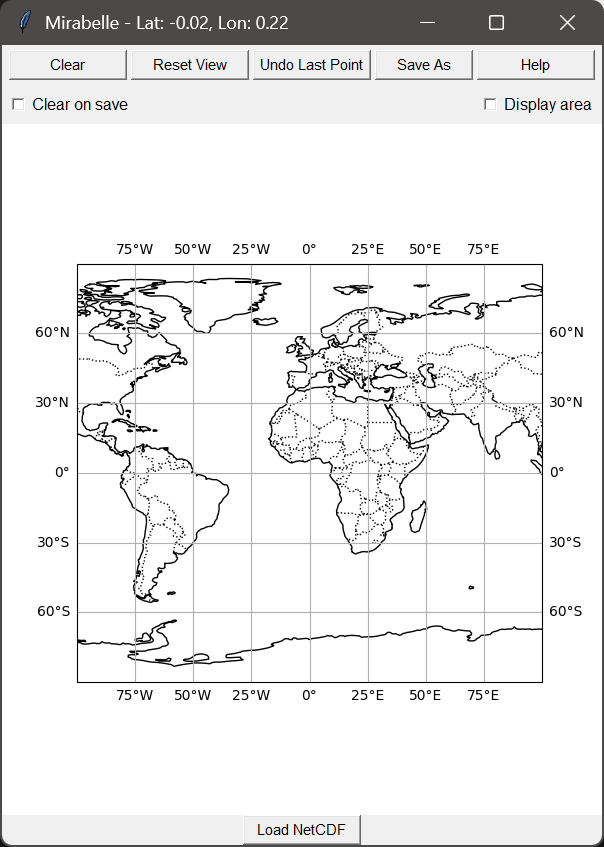

# Mirabelle
  [](https://github.com/Nevpzo/Mirabelle/commits/main)

[](LICENSE) [](https://zenodo.org/badge/latestdoi/1035065024)

Interactive mapping tool to manually define polygonal masks and export them in netCDF format, ready for use with climate and weather models.

<p align="center">  </p>

When working with climate or weather data, isolating specific regions for targeted analysis is often essential. Pre-made masks sometimes exist, but adapting them to match the model's grid can be time consuming.

Mirabelle offers a fast, intuitive way to:

- Load a reference netCDF file from your model (containing longitude and latitude information) and zoom to the dataset’s region
- Draw custom polygonal masks directly on the map
- Export masks in netCDF format for direct integration into model workflows

# Requirements
The program requires:
- `numpy`
- `matplotlib`
- `tkinter`
- `cartopy`
- `netCDF4`
- `shapely`
- `pyproj`

Install missing dependencies with:
```
pip install numpy matplotlib cartopy netCDF4 shapely pyproj
```

# Usage

```bash
git clone https://github.com/Nevpzo/Mirabelle.git
cd Mirabelle
python Mirabelle.py
```

The tool opens showing a global map, you have to load a reference netCDF file containing longitude and latitude information. You can then define polygons with the mouse:

**Mouse controls:**
- **Left Click**: Place a vertex of the polygon. Vertices are connected automatically.
- **Right Click**: Close the polygon (connect last vertex to the first).
- **Middle Click + Drag**: Pan the map.
- **Scroll Wheel**: Zoom in and out.
- **Ctrl + Right Click**: Remove a polygon.

**Buttons:**
- **Undo Last Point**: Removes the most recent vertex from the active polygon.
- **Reset View**: Restores the original zoom and position.
- **Clear View**: Removes all polygons and resets the map.
- **Save As**: Exports the current mask to a `.nc` file.
- **Clear on save** *(checkbox)*: Clears all polygons after saving.
- **Display area** *(checkbox)*: Shows polygon area in m² on the map.

**Keyboard shortcuts:**
- `Ctrl+S` → Save
- `Ctrl+Z` → Undo last point
- `Ctrl+R` → Reset view
- `Ctrl+Q` → Quit
- `Ctrl+Backspace` → Clear view

# Notes
- The reference file must contain longitude and latitude variables with names from this list:

<div align="center">

| Longitude   | Latitude |
| ----------- | -------- |
| longitude   | latitude |
| lon         | lat      |
| x           | y        |
| long        |          |

</div>

- Multiple polygons can be drawn before saving. They will be combined into a single mask.

### Contributing

Mirabelle is an early-stage research tool.   If you encounter bugs, have feature requests, or want to contribute, please reach out by email: nnevpzo@gmail.com.  

If you use Mirabelle in your research, please cite: [](https://zenodo.org/badge/latestdoi/1035065024)

Mirabelle is released under the GNU GPL v3 License.
